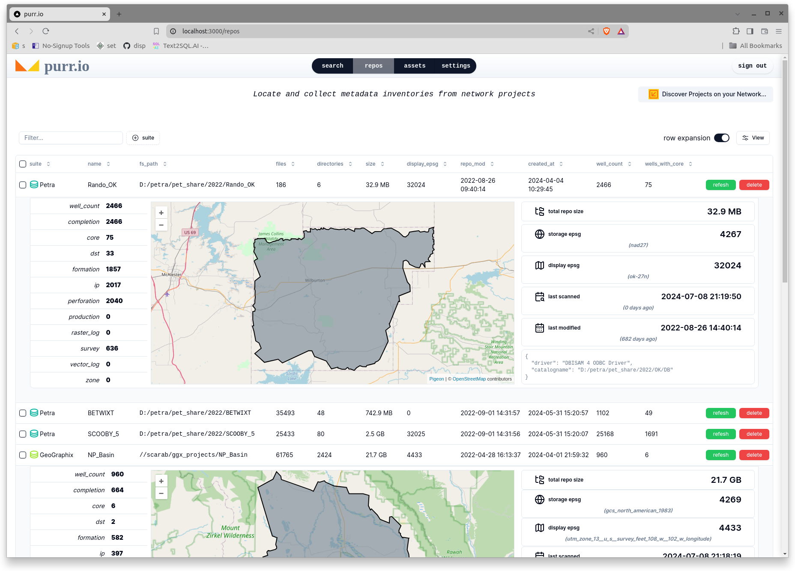
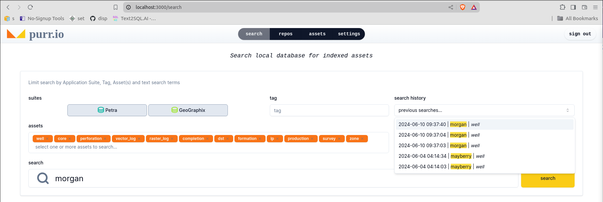

# purr.io

### A hybrid-cloud data quality search engine for geoscientists and engineers.

#### Proprietary data stays on customer's LAN; business logic lives in the cloud.

Purr.io is a Supabase-backed, Vercel-hosted React app that acts as a "remote control" for a Windows Python client via websockets. It can identify projects and query asset data within geo-application databases on a customer's LAN in real-time.

---

---

See the worker repos to get an idea how this web app interacts with LAN-based workers via web-sockets:

- [purrio_geographix](https://github.com/rbhughes/old_purrio_geographix)
- [purrio_petra](https://github.com/rbhughes/old_purrio_petra)
- [purrio_edge](https://github.com/rbhughes/old_purrio_edge)

## $${\textsf{\color{red}Work on purr.io is currently suspended}}$$
